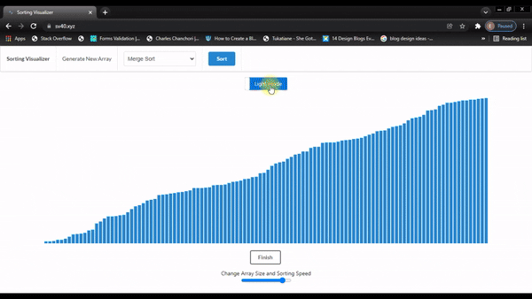

# Sorting Visualizer

This project is a Web Visualization tool for sorting algorithms.

I created a sorting algorithm visualizer to bridge the gap between theoretical understanding and practical application. The project allowed me to deepen my grasp of complex algorithms, improve programming skills, and offer an interactive learning tool for others. I hope that you enjoy playing around with this visualization tool just as much as I enjoyed building it

Dive into the world of sorting algorithms through this interactive visualizer. [https://sv.elijahmurimi.dev](https://sv.elijahmurimi.dev)

### Demo


 ## Local setup.
 Before diving in, ensure you have Nodejs installed and yarn as your package manager for a seamless setup of the Sorting Algorithm Visualizer. `npm` can also be used. Running the Sorting Algorithm Visualizer locally, first clone the repository.

 	git clone https://github.com/elijahmurimi40/sorting-visualizer.git

  To install all the dependencies of the project.

  	yarn
Then

	yarn start

 Have fun.
## License

MIT License

```Copyright (c) 2021 fortie40

Permission is hereby granted, free of charge, to any person obtaining a copy
of this software and associated documentation files (the "Software"), to deal
in the Software without restriction, including without limitation the rights
to use, copy, modify, merge, publish, distribute, sublicense, and/or sell
copies of the Software, and to permit persons to whom the Software is
furnished to do so, subject to the following conditions:

The above copyright notice and this permission notice shall be included in all
copies or substantial portions of the Software.

THE SOFTWARE IS PROVIDED "AS IS", WITHOUT WARRANTY OF ANY KIND, EXPRESS OR
IMPLIED, INCLUDING BUT NOT LIMITED TO THE WARRANTIES OF MERCHANTABILITY,
FITNESS FOR A PARTICULAR PURPOSE AND NONINFRINGEMENT. IN NO EVENT SHALL THE
AUTHORS OR COPYRIGHT HOLDERS BE LIABLE FOR ANY CLAIM, DAMAGES OR OTHER
LIABILITY, WHETHER IN AN ACTION OF CONTRACT, TORT OR OTHERWISE, ARISING FROM,
OUT OF OR IN CONNECTION WITH THE SOFTWARE OR THE USE OR OTHER DEALINGS IN THE
SOFTWARE.
